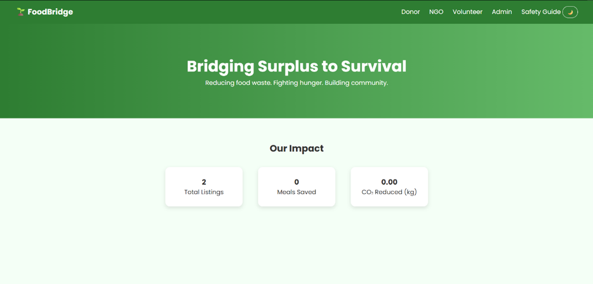
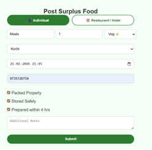
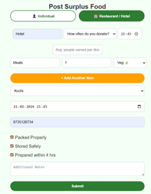
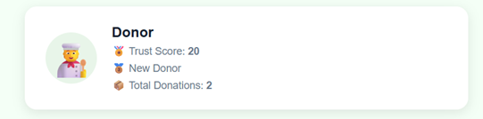
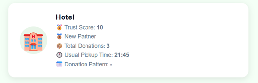
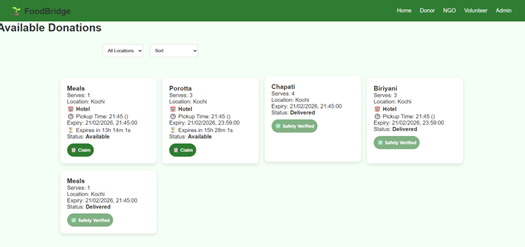
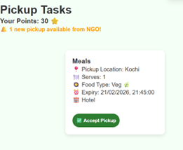
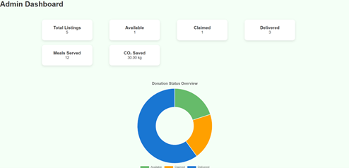

<p align="center">
  
</p>

# FoodBridge 🌱

## Basic Details

### Team Name: Tech Tarts

### Team Members
- Member 1: Annu Philip - Muthoot Institute of Technology and Science
- Member 2: Meghna Pradeep - Muthoot Institute of Technology and Science

### Hosted Project Link
[https://24ct055-coder.github.io/FoodBridge/](https://24ct055-coder.github.io/FoodBridge/)

### Project Description
FoodBridge is a surplus food redistribution platform that connects food donors, NGOs and volunteers to reduce food waste and fight hunger. It features a trust-based verification system, urgency tracking and real-time impact metrics.

### The Problem Statement
Every day, tonnes of surplus food from homes, restaurants and hotels goes to waste while thousands of people in the same city go hungry. There is no efficient system connecting those who have excess food with those who need it — leading to both food waste and food insecurity existing side by side.

### The Solution
FoodBridge bridges this gap through a structured four-role workflow. Donors post surplus food with safety details. NGOs spot the listing, claim it and coordinate with volunteers for pickup. Volunteers collect the food directly from the donor and deliver it to the NGO. The NGO then takes charge of further distribution to those in need. A trust-based point system ensures accountability at every step — donors and volunteers earn verified reputation scores based on actual outcomes, not self-reporting.

---

## Technical Details

### Technologies/Components Used

**For Software:**
- Languages used: HTML, CSS, JavaScript
- Frameworks used: None (Vanilla JS)
- Libraries used: Chart.js (Admin dashboard visualization), Google Fonts (Poppins)
- Tools used: VS Code, Git & GitHub, Live Server

---

## Features

- **Role-based Dashboard** — Separate panels for Donor, NGO, Volunteer and Admin
- **Trust Point System** — NGO verifies food safety and awards points to donors and volunteers
- **Urgency Detection** — Food expiring within 2 hours is automatically flagged
- **Business Donor Support** — Restaurants/hotels can register with pickup schedules and post multiple items at once
- **Volunteer Notification** — Volunteers are notified when NGO claims a donation in their area
- **Real-time Impact Metrics** — Tracks total listings, meals saved and CO₂ reduced
- **Admin Dashboard** — Doughnut chart showing donation status overview
- **Dark Mode** — Toggle between light and dark themes
- **Auto Expiry Cleanup** — Expired unclaimed donations are automatically removed
- **Countdown Timer** — Live countdown on each donation card in NGO view

---

## Implementation

### Installation
No installation required. Just open the project folder in a browser.
```bash
git clone https://github.com/24ct055-coder/FoodBridge.git
cd FoodBridge
```

### Run
Open `index.html` in any modern browser. For best results use Live Server in VS Code:

> Right click `index.html` → Open with Live Server

---

## Project Documentation

### Screenshots

#### 🏠 Homepage
> Bridging surplus to survival — see our real-time impact



---

#### 🍽️ Donor Portal
> Post surplus food in seconds — as an individual or a business

| Individual Donor | Restaurant / Hotel |
|---|---|
|  |  |

---

#### 👤 Donor Profiles
> Track your trust score and donation history

| Individual Profile | Hotel Profile |
|---|---|
|  |  |

---

#### 🤝 NGO Page
> Claim food by urgency — live countdown shows what needs to go first



---

#### 🚴 Volunteer Page
> Get notified instantly when food is claimed and ready for pickup



---

#### 📊 Admin Dashboard
> Monitor every donation from listing to delivery — in one view



---

### Application Workflow
```
Donor posts surplus food (with safety checklist)
            ↓
NGO sees listing → Claims it
            ↓
Volunteer gets notified → Accepts pickup
            ↓
Volunteer delivers food to NGO
            ↓
NGO marks received → Verifies food safety
            ↓
Trust points awarded to Donor (+10) and Volunteer (+10)
```

---

## Project Demo

### Video
[Watch Demo on Google Drive](https://drive.google.com/file/d/1JvLpGCZPeYQ6yRZLBoUwM9mnAkpks5J/view?usp=drive_link)

*Demonstrates the full donation flow — from food posting to NGO claim, volunteer pickup, delivery and trust point verification.*

---

## AI Tools Used

**Tool Used:** Claude (Anthropic)

**Purpose:** Development assistance throughout the project

**Key uses:**
- Debugging localStorage data flow between pages
- Implementing the trust point system logic
- Building the NGO claim and safety verification workflow
- CSS styling and profile card design
- Code review and error fixing

**Percentage of AI-assisted code:** ~75%

**Human Contributions:**
- Problem identification and solution concept
- Overall architecture and role design
- Business donor feature ideation
- Trust system concept and flow design
- UI/UX decisions and feature prioritization
- Testing, debugging and integration
- Demo preparation and presentation

---

## Team Contributions

- **Meghna Pradeep:** Frontend development,UI design & styling 
- **Annu Philip:** Volunteer flow, admin dashboard, donor and NGO logic, trust system

---

## License

This project is licensed under the MIT License.

---


